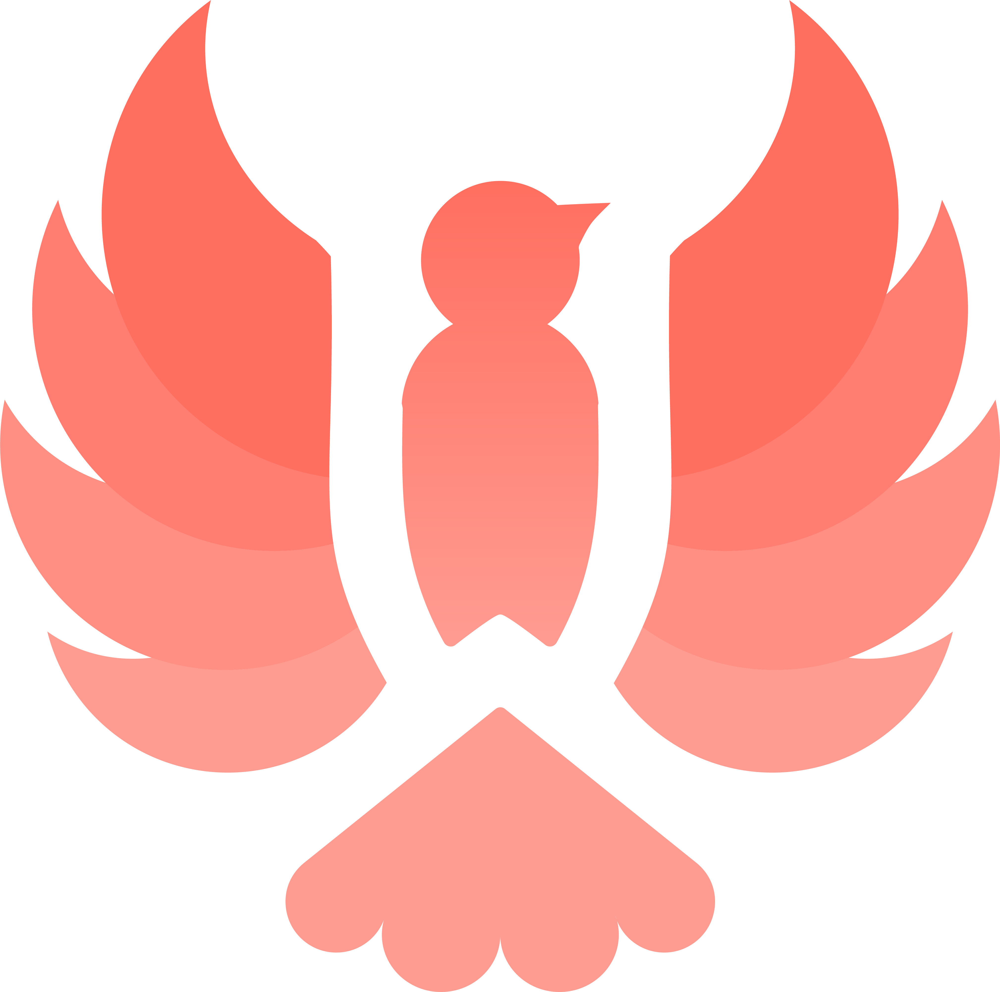

<h1 align="center"> codeW 2021 </h1>
<div align="center">
  
</div>


<p align="center"> 
  Annual Coding Marathon for Females. Nazarabayev University ACM Women Student Chapter.
</p>

<p align="center">
  This repository is a source of React website created with styled-components and React smooth scroll.
</p>

## Installation
1. Clone the project
```bash
git clone https://github.com/kammnd/codew2021.git
```
2. Install dependecies
```bash
cd codew2021
npm install
```
3. Set up the development server
```bash
npm start
```

## Contributing
Pull requests are welcome. For major changes, please open an issue first to discuss what you would like to change.

## Acknowledgements 
Thanks to Brian Design, basultobdKs for his React-Context usage tutorial and [source code](https://codesandbox.io/s/react-context-multilanguage-4cjib).
Also thanks to ACM W team: all the stickers' designers and translators.
